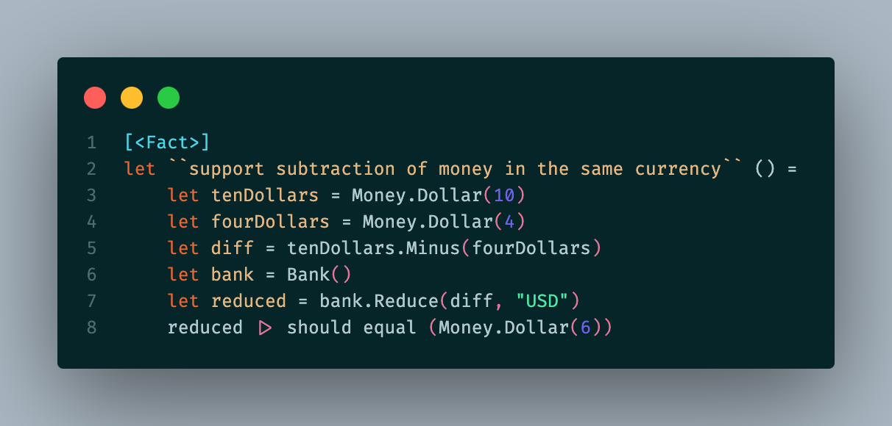
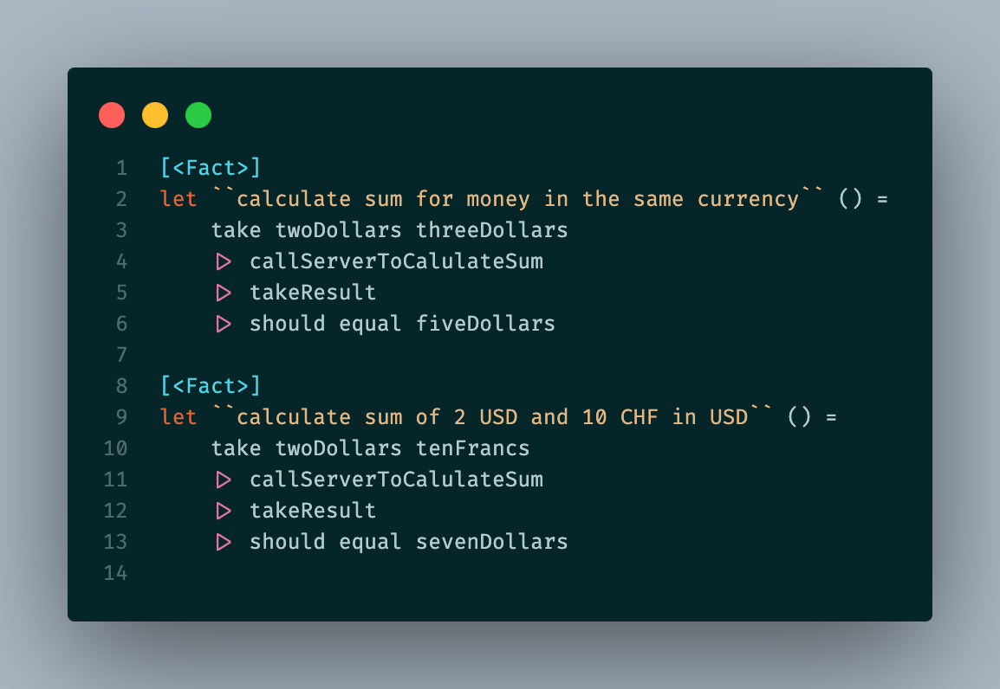

# How to use F# to test project written in C#

This repository aims to present that it's possible to reference a C# project to an F# test project.

As you can see, tests written in F# are easy to read. Test projects use plain F#. Test projects reference [FsUnit.Xunit](https://fsprojects.github.io/FsUnit/xUnit.html) library.

### Domain

The sample domain is taken from [Kent Beck's `Test-Driven Development: By Example`](amazon.com/Test-Driven-Development-Kent-Beck/dp/0321146530) book.

`SuperStore` is a C#'s library containing a sample definition of the `Money` concept. More details can be found in Kent's book.

`SuperStore.Api` is a WebApi project which exposes a subset of the Money domain. It supports a simple sum of two currencies provided by a bank.

### Referencing C# library to F# test project

`SuperStore.UnitTests` contains sample code that presents how F# facilitates readable tests for WebAPI project:

### Referencing C# WebApi project to F# test project

`SuperStore.Api.Tests` is an Xunit test project written in F#. The project uses ASP.NET test server feature.

### Contribution

I'm aware that the code isn't ideal. Everyone is invited to the contribution.